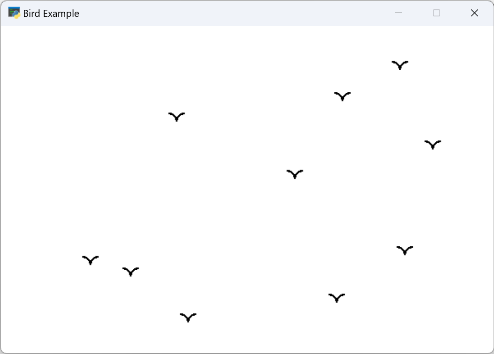

# README.md
Our bird [program](birds.py) is a simple example of using the arcade library to draw graphics on a window. It works as follows:

- We import the arcade and random libraries to use their functions.
- We define some constants and variables for the screen size, the bird parameters, and the window title.
```
SCREEN_WIDTH = 600
SCREEN_HEIGHT = 400
SCREEN_TITLE = "Bird Example"
```
- We define a function called `draw_bird` that takes the x and y positions, the size, the color, and the border width of a bird as arguments. The function draws a bird using two arc outlines with different start and end angles to make a V shape.
- `draw_bird` takes in 5 parameters: `x`, `y`, `size`, `color`, and `border_width`. The function uses the arcade library to draw an outline of a bird shape consisting of two arcs. The left arc starts at an angle of 0 and ends at an angle of 90, and the right arc starts at an angle of 90 and ends at an angle of 180. The bottom of the two arcs touch each other at position (x + size, y). The color and border width of the bird shape can be customized using the `color` and `border_width` parameters respectively.
```
def draw_bird(x, y, size, color, border_width):
    # Draw the left arc with start angle of 0 and end angle of 90
    arcade.draw_arc_outline(x, y, size, size, color, 0, 90, border_width)
    # Draw the right arc with start angle of 90 and end angle of 180
    # Adjust the x position by the size to make the arcs touch at the bottom
    arcade.draw_arc_outline(x + size, y, size, size, color, 90, 180, border_width)
```
- We open a window with the given width, height, and title using the arcade.open_window function.
- We set the background color to white using the arcade.set_background_color function.
- We start the render process using the arcade.start_render function. This prepares the window for drawing commands.
- We draw 10 birds using a `for` loop that iterates 10 times. In each iteration, we generate random x and y positions for a bird using the random.randint function. We make sure that the x position is within the screen width minus twice the bird size, and the y position is within the screen height minus the bird size. This prevents the birds from going out of bounds. We then call the draw_bird function with the random x and y positions, and the predefined size, color, and border width of a bird.
```
for i in range(10):
    # Generate random x and y positions within the screen boundaries
    bird_x = random.randint(0, SCREEN_WIDTH - bird_size * 2)
    bird_y = random.randint(0, SCREEN_HEIGHT - bird_size)
    # Draw a bird using the function and the variables
    draw_bird(bird_x, bird_y, bird_size, bird_color, bird_border_width)
```
- We finish the render process using the `arcade.finish_render` function. This displays the graphics on the window.
- We run the program using the `arcade.run` function. This keeps the window open until we close it manually.

Here is an example output:

