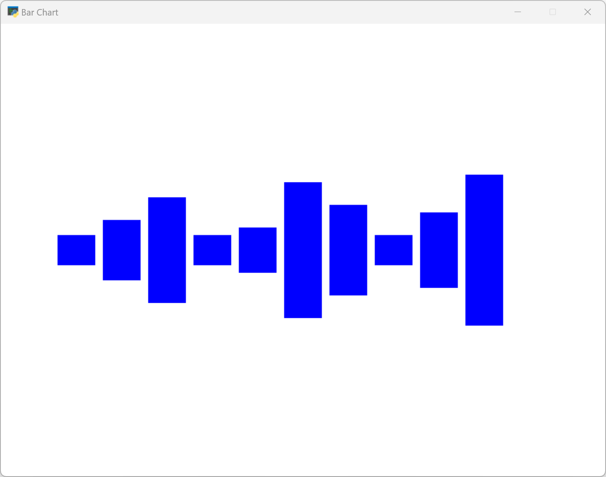
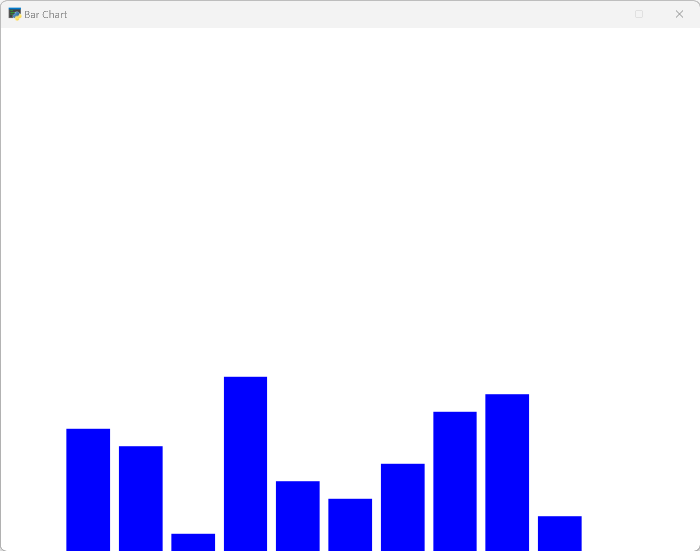
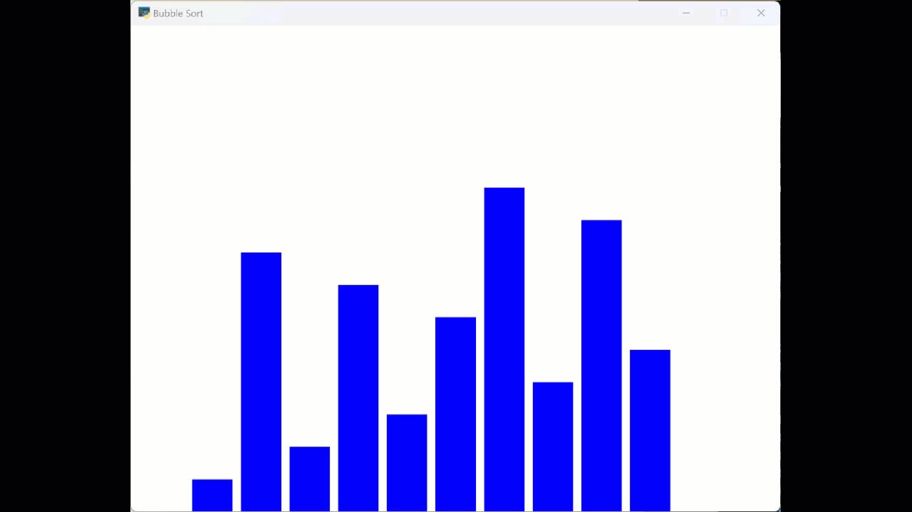

This program was written with Google Bard's assistance. 

Initially I asked for 10 random numbers between 1 and 10 (inclusive) to be stored in a list named "numbers", and to use the Arcade library to draw a bar chart of the numbers. 

This is what I got:

I quickly realized my prompt was not technical enough, so I then asked Bard to start each each bar from the bottom of the screen and make the number list include each number from 1 to 10, randomized.

That's better! Now it's time to make it work with [bubble sort](resources.md).

ChatGPT had a lot of problems getting the bubble sort animation working and finally had to resort to multi-threading. Check out the [code](bubble-sort.py) to see how it works.

## Program Summary

The program utilizes the Arcade library in Python to visualize the Bubble Sort algorithm through a bar chart representation. The main steps of the program are as follows:

1. Initialize a list called "numbers" with 10 random numbers between 1 and 10, inclusive.
2. Open a window using the Arcade library and set the background color to white.
3. Define a function called `draw_barchart()` that is responsible for rendering the bar chart based on the current state of the "numbers" list.
4. Define a function called `bubble_sort()` that implements the Bubble Sort algorithm to sort the "numbers" list.
5. Create a separate thread using the threading module to run the `bubble_sort()` function in the background while the main thread handles rendering the bar chart.
6. Schedule the `draw_barchart()` function to be called repeatedly at 60 frames per second to update the visualization of the bar chart.
7. Run the Arcade event loop to keep the window open and allow the rendering and sorting processes to occur concurrently.
8. As the sorting process takes place, the `bubble_sort()` function swaps elements in the "numbers" list and introduces a delay of 0.5 seconds between swaps.
9. The `draw_barchart()` function is scheduled to be called after each swap, resulting in the bar chart being updated to reflect the changes in the sorting process.
10. Once the sorting process is complete, the final sorted bar chart is displayed in the window.

In summary, this program generates a randomized list of numbers, applies the Bubble Sort algorithm to sort the list, and visually represents the sorting progress using a bar chart. It demonstrates the concurrent execution of sorting and rendering processes using threads and provides a visual representation of how Bubble Sort operates on a dataset.